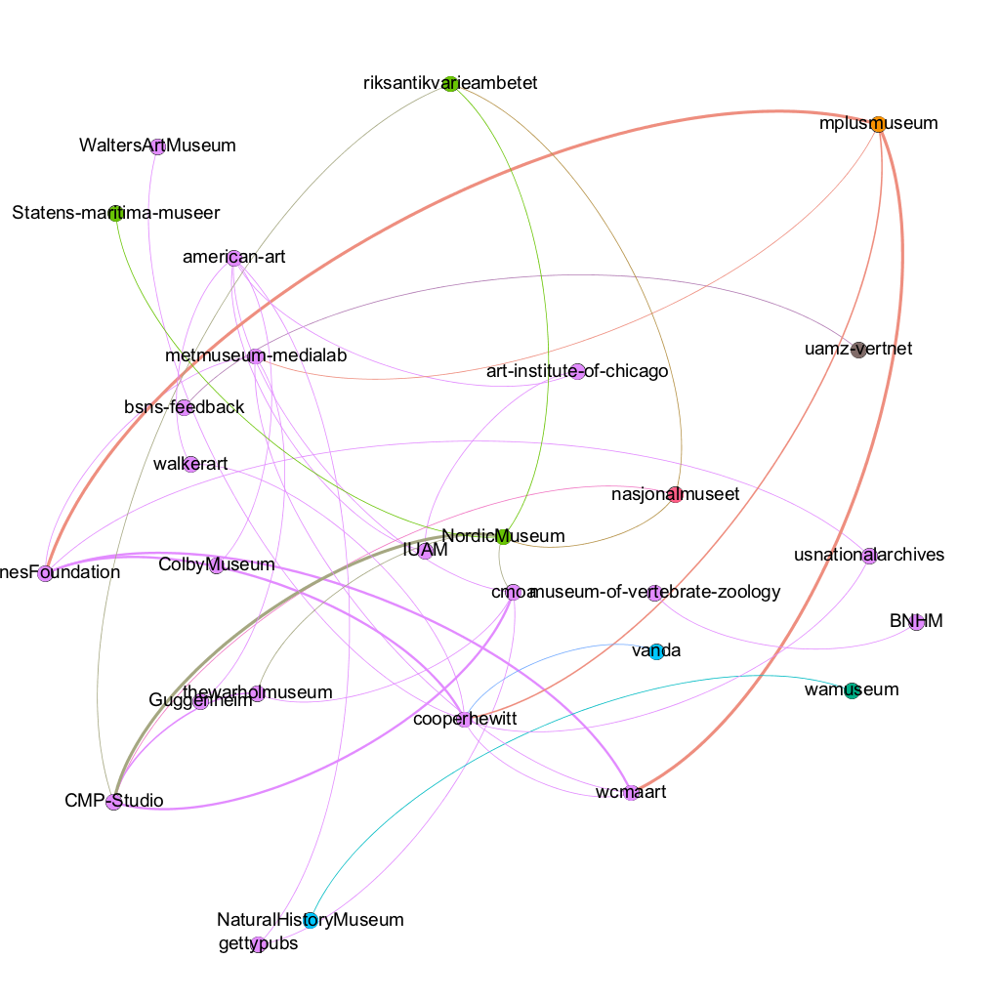

# Museum-GitHub API Scraper

This was forked from Emanuel Feld’s [government-github](https://github.com/emanuelfeld/government-github), which he used for his quite nicely-done analysis “[The Government GitHub Network](https://emanuelfeld.github.io/blog/2016/04/27/government-github-ecosystem.html)”. The article was published on his site and I came across it via [18F](https://18f.gsa.gov/2016/06/16/emanuel-feld-talks-about-his-vizualization-of-government-github-organizations/).

The parallels between Government usage and Museum usage of GitHub seem clear. Indeed, all I’ve done here thus far are refactor the language to point things to `muse` or `museum` rather than `gov` or `government`. I also created a new set of source data modeled on the source data used in the original, which comes from [government.github.com](https://github.com/github/government.github.com/tree/gh-pages/_data).

Two notes on the original data source:

1. Feld inserted the government.github.com repo as a submodule of his own project and then pulled the data direct. While so far I’ve simply added in the needed source data directly (into the `data-src` directory), I like the submodule idea and could see it working well with an expanded version of the existing [museums-on-github](https://github.com/Ambrosiani/museums-on-github) repo.

2. The government data included both governments and so-called “civic hackers”, meaning individuals and organizations working on open source on behalf of governments. This seemed an apt idea for museums as well, to capture the many folks outside of museums but writing code specifically for them.

Once running, this repo creates a SQLite database of all the relevant data from GitHub, and then outputs three specific JSON files, which are converted to GEXF files, which can be opened in [Gephi](https://gephi.org/) for visualization. This one shows museums connected to one another via common contributors.



I’m not yet sure if the three graphs the original repo churns out are the best ones for analyzing the smaller museum GitHub community, but I appreciate the utility this code offers of creating a database from the GitHub API data, and being able to then create JSON for visualization of it via SQL queries. (The [SQLite DB Browser](http://sqlitebrowser.org/) is a good free tool.) The other tables and charts included in Feld’s analysis were done on his own and with R. I’m not sure if that process is documented anywhere.

## To Set Up and Run

1. Update the GitHub user names listed in `data-src` YAML files if you’d like. The headings are arbitrary but will eventually create the groupings used in the visualizations. Currently by country.

2. Add your 40-character GitHub access token to `muse/settings.py`. You can get a token by running the following in the command line, with your_username from GitHub:

		```
		curl -i -u your_username -d '{"scopes": ["repo", "user"], "note": "Museum-GitHub API Scraper"}' https://api.github.com/authorizations
		```

3. Install [Python](https://www.python.org/) if not already installed. I’m running 2.7 on macOS. With Python installed, you may already have [pip](https://pip.pypa.io/en/stable/installing/) and [virtualenv](https://virtualenv.pypa.io/en/stable/installation/), otherwise install them. I also needed to add virtualenv to my $PATH.

4. In the command line:

		```
		virtualenv env
		. env/bin/activate
		pip install -r requirements.txt
		python create_db.py  # initialize database
		python muse/scraper.py  # scrape github api to populate database
		datafreeze freezefile.yaml  # query database to generate org level connections
		python muse/networks.py  # generate gephi network files of org connections

		```

Depending on the number of users/organizations you’re including, the `scraper.py` can take quite some time to run as it’s making a lot of calls to the GitHub API.

When complete, type `deactivate` to shut down the virtual python environment set up by `virtualenv`.

